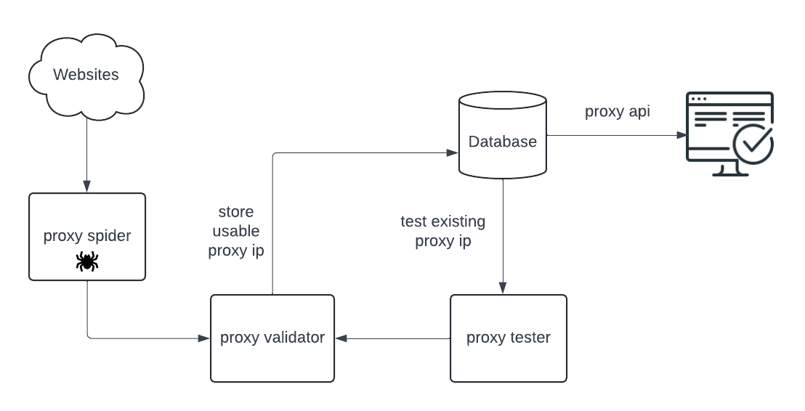

# IP Proxy Pool

## Introduction
When performing web scraping, one of the most common anti-crawling techniques is IP blocking, where a website restricts access if the same IP address is used too frequently. To overcome this problem, it's essential to frequently change IP addresses, typically using proxy IPs.

While a paid proxy IP provider with a robust interface and high stability may negate the need for a proxy pool, the reality is different. Free proxies are notoriously unstable, often with only about 10% being usable at any given time, and even paid proxies are not completely reliable. Hence, employing a proxy pool is necessary to ensure the stability and efficiency of web scraping tasks.

This project introduces a simple proxy pool designed to facilitate web scraping. It offers asynchronous proxy IP acquisition, verification, and storage capabilities. Additionally, it provides a web service interface for obtaining proxy IPs, ensuring a reliable and continuous supply of functional proxies.

**Warning:**
It is risky to use free proxies for web scraping tasks, as they may be unreliable or even malicious:
- the user behavior may be monitored and recorded, the cookies may be stolen
- the data you scrape may be tampered with, or you may be redirected to a phishing site

## Project Design

<!-- image -->


### Main Tech Stack
- requests: To send requests and retrieve page data
- lxml: To extract the required data from the page using XPATH
- pymongo: To store the extracted proxy IPs in MongoDB and to read proxy IPs from MongoDB for the crawler
- Flask: To provide web services

### Project Structure
```
|-- IP-Proxy-Pool
    |-- core
        |-- db
            |-- __init__.py
            |-- mongo_pool.py
        |-- proxy_validate
            |-- __init__.py
            |-- httpbin_validator.py
        |-- proxy_spiders
            |-- __init__.py
            |-- base_spider.py
            |-- proxy_spiders.py
            |-- run_spiders.py
        |-- proxy_test.py
        |-- proxy_api.py
    |-- domain.py
    |-- utils
        |-- __init__.py
        |-- http.py
        |-- log.py
    |-- main.py
    |-- settings.py
    |-- requirements.txt
```


## Preparing Environment
Clone the repo into your local environment 
```bash
git clone https://github.com/Kugelbrecher/IP-Proxy-Pool.git
```

Create a virtual environment (assuming you have virtualenv installed)
```bash
python3 -m venv venv
```

Activate the virtual environment
```bash
source venv/bin/activate
```

Install dependencies
```bash
python3 -m pip install -r requirements.txt
```


## Connecting to MongoDB
```bash
brew services start mongodb/brew/mongodb-community

# open a new terminal(command + n)
mongosh
show dbs
use proxies_pool
show collections

db.proxies.find()
db.proxies.countDocuments() 

brew services stop mongodb/brew/mongodb-community
```
